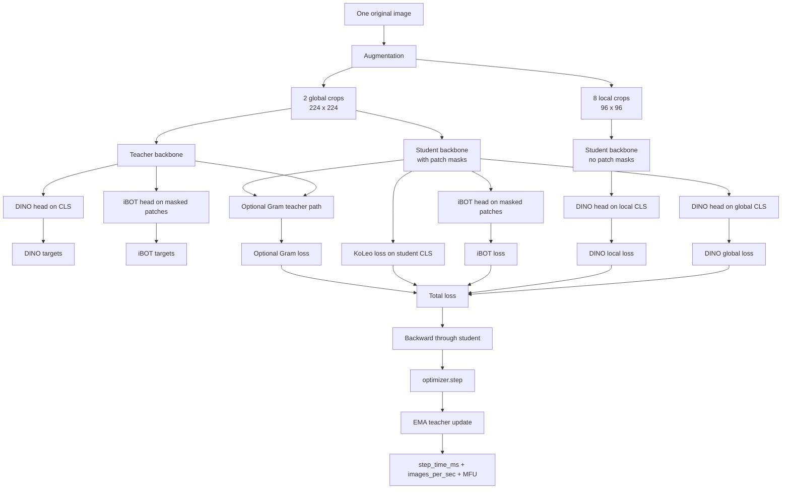
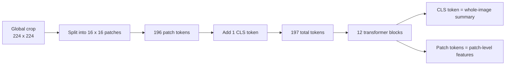

# Understanding DINOv3 and the MFU Work on This Branch

This guide is for someone who is new to:

- DINOv3
- vision transformers
- self-supervised learning
- iBOT
- MFU

It is written as a "zoom lens" guide:

1. Start with the big picture.
2. Then look at one training step.
3. Then look at the MFU implementation and how to verify it.

The branch this guide describes is `mfu-tracking-baseline`.

---

## If You Only Remember 8 Things

1. This branch adds MFU tracking to the training loop, plus tests, scripts, and writeups.
2. The main training model is a ViT-B/16 vision transformer: 12 layers, hidden size 768, patch size 16.
3. One original image becomes 2 global crops and 8 local crops during training.
4. The student model learns from a teacher model that is an EMA (moving average) of the student.
5. `DINO` is the whole-image / CLS-token learning signal.
6. `iBOT` is the masked-patch learning signal.
7. The branch originally underreported MFU by 2x because it mixed up MACs and hardware FLOPs, then fixed that.
8. The current measured baseline on this branch is about 9.9% hardware MFU on 2 H100s and about 11.3% hardware MFU overall on 8 H100s, with higher steady-state windows.

---

## What Was Actually Added on This Branch

Relative to `master`, this branch has 3 MFU-related commits:

| Commit | Purpose | Why it matters |
|---|---|---|
| `37b14bd` | Initial MFU implementation | Added MFU math, CUDA-event timing, logging, tests, validation scripts, and docs |
| `6c943fc` | MFU convention fix | Corrected a 2x bug: MACs had to be converted to hardware FLOPs before dividing by H100 peak TFLOPS |
| `775af3f` | Docs errata pass | Updated the docs so the explanation matches the corrected implementation |

Files changed vs `master`:

| File | Role |
|---|---|
| `dinov3/utils/mfu.py` | New MFU math utilities |
| `dinov3/train/train.py` | Timing and MFU logging added inside `do_train()` |
| `tests/test_mfu.py` | 14 tests for scaling rules and sanity checks |
| `scripts/mfu_validation_run.sh` | 2-GPU validation run |
| `scripts/mfu_8gpu_real_data.sh` | 8-GPU real-data baseline run |
| `docs/mfu-results-2026-03-30.md` | Validation and measured baseline results |
| `docs/dinov3-mfu-tracking-initial-brief-03-27-26.md` | Original brief plus errata |
| `docs/mfu-autonomous-plan-03-30-26.md` | Original execution plan plus errata |
| `learnings/gpu_performance.md` | Performance takeaways from the runs |

Short version: the branch did not change the learning algorithm itself. It added measurement, verification, and documentation around how much compute the existing training loop is actually using.

---

## Bird's-Eye Map

Think of one training step like this:

- Start with one original satellite image.
- Make multiple views of it.
- Run the student on more views than the teacher.
- Compare student outputs to teacher outputs.
- Backprop only through the student.
- Time that step.
- Turn throughput + estimated work per image into MFU.



---

## What DINOv3 Is Doing Here, in Plain English

### First: what is a vision transformer here?

A ViT takes an image and chops it into little square tiles called patches.

- Global crop size: `224 x 224`
- Patch size: `16 x 16`
- So a global crop becomes `14 x 14 = 196` patches
- Add one special `CLS` token
- Total global sequence length: `197`

For local crops:

- Local crop size: `96 x 96`
- Patch size: `16 x 16`
- So a local crop becomes `6 x 6 = 36` patches
- Add one `CLS` token
- Total local sequence length: `37`

Visual picture:



Concrete analogy:

- Patch tokens are like 196 little notes about local parts of the image.
- The CLS token is like the "executive summary note" for the whole crop.

### Second: what is DINO?

DINO is a student-teacher self-distillation setup.

- The student sees both global and local crops.
- The teacher sees only global crops.
- The student tries to match the teacher's output distribution.

Important: there are no class labels here. The teacher is not saying "this is a farm" or "this is a road." Instead, it maps each crop to a distribution over many learned prototypes.

In this repo:

- DINO head output dimension: `65536` prototypes
- The teacher output is balanced with Sinkhorn-Knopp before being used as the target

Concrete analogy:

- Imagine 65,536 unlabeled buckets.
- The teacher says: "this crop should mostly land in bucket 18,472, somewhat in 4,109, a little in 59,201."
- The student tries to produce a similar distribution.

Why use Sinkhorn-Knopp?

- Without it, the model can collapse into putting everything in one bucket.
- Sinkhorn-Knopp forces the assignments to stay more balanced across buckets.

### Third: what is iBOT?

iBOT is the patch-level masked prediction signal.

This is the simplest useful mental model:

- DINO teaches the student to understand the whole scene.
- iBOT teaches the student to understand hidden parts of the scene.

More concretely:

- Some patches in the student global crops are masked.
- The teacher still sees the full global crop.
- The student must predict teacher-style targets for the masked patches only.

Concrete analogy:

- DINO: "Do these zoomed-out and zoomed-in photos seem to come from the same place?"
- iBOT: "If I cover a few tiles in the student's image, can the student still infer what belongs there from context?"

That is why iBOT is especially important for understanding local structure, not just whole-image identity.

### Fourth: what is KoLeo?

KoLeo is a regularizer that tries to keep student representations from bunching up too tightly.

Simple intuition:

- If every embedding sits on top of every other embedding, the space is useless.
- KoLeo pushes nearby points apart enough to keep the representation space spread out.

### Fifth: what is Gram here?

`Gram` is an optional extra patch-level alignment path in this repo.

- It uses a separate frozen or semi-frozen teacher path.
- It compares student patch features to Gram-teacher patch features.
- It is off by default in `ssl_default_config.yaml`.

For the MFU branch, Gram matters because it adds extra teacher-side forward compute when enabled.

---

## The Concrete Model Setup in This Repo

From `dinov3/configs/ssl_default_config.yaml`, the default setup relevant to MFU is:

| Setting | Value |
|---|---|
| `student.arch` | `vit_base` |
| `student.patch_size` | `16` |
| `student.ffn_ratio` | `4.0` |
| `student.n_storage_tokens` | `0` |
| `student.in_chans` | `5` |
| `crops.global_crops_size` | `224` |
| `crops.local_crops_size` | `96` |
| `crops.local_crops_number` | `8` |
| `ibot.mask_sample_probability` | `0.5` |
| `ibot.mask_ratio_min_max` | `[0.1, 0.5]` |
| `gram.use_loss` | `false` by default |

So the MFU implementation on this branch is aimed at the default satellite ViT-B training setup, not an arbitrary architecture.

This matters a lot for verification later.

---

## The Training Loop, Step by Step

If you want one "story of the tensors," this is it.

### 1. `train.py` builds the data loader

Key file:

- `dinov3/train/train.py`

Inside `build_data_loader_from_cfg()`:

- crop sizes are read from config
- a masking generator is created for iBOT
- `collate_data_and_cast()` is used to assemble batch tensors

### 2. One original image becomes many views

Key files:

- `dinov3/train/ssl_meta_arch.py`
- `dinov3/data/datasets/augmentation.py`
- `dinov3/data/collate.py`

The augmentation pipeline creates:

- 2 global crops
- 8 local crops

Then the collate function stacks them across the batch:

- `collated_global_crops`
- `collated_local_crops`
- `collated_masks`
- `mask_indices_list`

Important detail:

- masks are for global crops
- local crops are not masked

That is why iBOT is a global-crop masked-patch objective here.

### 3. The teacher runs first

Key file:

- `dinov3/train/ssl_meta_arch.py`, method `get_teacher_output()`

Teacher behavior:

- sees only global crops
- backbone produces `CLS` and patch tokens
- DINO head runs on `CLS`
- iBOT head runs only on the masked patches selected by `mask_indices_list`
- outputs are turned into balanced teacher targets with Sinkhorn-Knopp

The teacher has no gradients.

### 4. The student runs next

Key file:

- `dinov3/train/ssl_meta_arch.py`, method `get_student_output()`

Student behavior:

- sees global crops and local crops
- global student crops are masked for iBOT
- local student crops are unmasked
- DINO head runs on student `CLS` tokens from both global and local crops
- iBOT head runs on masked student patch tokens from the global crops

The student is the only path that gets backpropagated through.

### 5. Losses are computed

Key files:

- `dinov3/loss/dino_clstoken_loss.py`
- `dinov3/loss/ibot_patch_loss.py`
- `dinov3/loss/koleo_loss.py`
- `dinov3/train/ssl_meta_arch.py`, method `compute_losses()`

Losses used in the default path:

| Loss | What it compares | Intuition |
|---|---|---|
| DINO global loss | student global CLS vs teacher global CLS targets | whole-image agreement across global views |
| DINO local loss | student local CLS vs teacher global CLS targets | zoomed-in views should still match the scene-level teacher view |
| iBOT loss | student masked patch outputs vs teacher masked patch targets | hidden local content should be inferable from context |
| KoLeo loss | student global CLS features only | keep the embedding space spread out |
| Gram loss | optional | extra patch alignment to a gram teacher |

### 6. Backprop, optimizer step, EMA teacher update

Key files:

- `dinov3/train/train.py`
- `dinov3/train/ssl_meta_arch.py`, method `update_ema()`

The order in the main loop is:

1. `optimizer.zero_grad()`
2. `model.forward_backward(...)`
3. gradient clipping
4. `optimizer.step()`
5. `model.update_ema(mom)`

That EMA update is how the teacher changes over time. The teacher is not trained directly by gradients. It is a smoothed moving average of the student.

Concrete analogy:

- Student = the person actively practicing
- Teacher = a calm long-exposure photo of that person over time

The teacher is usually more stable because it moves slowly.

---

## Where the MFU Tracking Was Added

The main implementation points are:

| Code location | What was added |
|---|---|
| `dinov3/utils/mfu.py` | math for per-image MACs and MFU |
| `dinov3/train/train.py` | precompute MACs, create CUDA events, compute `step_time_ms`, `images_per_sec`, `mfu` |
| `tests/test_mfu.py` | sanity and scaling tests |
| `scripts/mfu_validation_run.sh` | 2-GPU validation run |
| `scripts/mfu_8gpu_real_data.sh` | 8-GPU baseline run |

The main training-loop change is conceptually simple:

```text
record CUDA start event
run one training step
record CUDA end event
synchronize end event
measure elapsed time
convert batch size / elapsed time -> images_per_sec
convert images_per_sec + MACs/image -> MFU
log metrics
```

Timing region:


Important consequence:

- This is not full wall-clock job timing.
- It mostly measures the GPU training step itself.
- It excludes the idle time before `step_start_event.record()`.
- It also excludes eval and checkpoint time except on those iterations where extra syncs happen afterward.

So this is closer to "model-step MFU" than "end-to-end pipeline efficiency."

---

## The MFU Math on This Branch

## Step 1: count tokens per crop

Default branch setup:

- global crop: `224 / 16 = 14` patches per side -> `14 x 14 = 196` patches -> `197` tokens with CLS
- local crop: `96 / 16 = 6` patches per side -> `6 x 6 = 36` patches -> `37` tokens with CLS

## Step 2: estimate one forward pass of the ViT backbone

`dinov3/utils/mfu.py` uses:

```text
per-layer MACs =
    4 * seq_len * D^2          # QKV + output projection
  + 2 * seq_len^2 * D          # attention score + weighted sum
  + 2 * seq_len * D * ffn_dim  # FFN up + down
```

with:

- `D = 768`
- `ffn_dim = 4 * 768 = 3072`
- `num_layers = 12`

This gives approximately:

| Quantity | Approx value |
|---|---|
| global forward | `17.45 GMACs` |
| local forward | `3.17 GMACs` |

Why `MACs`, not `FLOPs`?

- A MAC is one multiply-add pair
- Hardware vendors count that as 2 FLOPs

That distinction caused the branch's only major correctness fix.

## Step 3: estimate one full training step per original image

The branch uses this mental breakdown:

```text
student_fwd = 2 * global_fwd + 8 * local_fwd
student_bwd = 2 * student_fwd
teacher_fwd = 2 * global_fwd
gram_fwd    = 2 * global_fwd if gram enabled else 0
heads       = about 5% overhead
```

So with default config and Gram disabled:

- total is about `226.4 GMACs/image`

That number is precomputed once per run in `train.py`.

## Step 4: convert throughput into MFU

The corrected formula on this branch is:

```text
actual_hardware_flops_per_sec =
    images_per_sec * 2 * macs_per_image

MFU =
    actual_hardware_flops_per_sec
    /
    (num_gpus * peak_tflops_per_gpu * 1e12)
```

For H100 BF16 (dense, no 2:4 structured sparsity):

- `peak_tflops_per_gpu = 989`

NVIDIA's published spec (1979 TFLOPS) assumes 2:4 structured sparsity. Standard
transformer and ViT training uses dense matmuls, so 989 TFLOPS is the correct denominator.

So:

```text
MFU = images_per_sec * 2 * macs_per_image / (num_gpus * 989e12)
```

---

## The Important 2x Bug and Why It Happened

This is the single most important "AI agent made a mistake, then fixed it" story on the branch.

### What went wrong?

The initial logic did this:

- numerator used `macs_per_image`
- denominator used H100 `989 TFLOPS` (dense BF16)

Problem:

- numerator was in MACs
- denominator was in hardware FLOPs

That is a unit mismatch.

### Why does that cause exactly a 2x error?

Because:

- `1 MAC = 1 multiply + 1 add`
- hardware FLOP specs count that as `2 FLOPs`

So if you forget the `2 * macs_per_image` conversion, MFU is exactly half of what it should be.

### What was fixed?

Commit `6c943fc` updated `compute_mfu()` to do:

```text
actual_tflops = (images_per_sec * 2 * macs_per_image) / 1e12
```

### Why this is actually a good sign

Because the branch did not just add instrumentation. It also corrected its own units and updated the tests and docs afterward. That is what you want from measurement code: the numbers should survive a unit-audit.

---

## Concrete Baseline Numbers

From `docs/mfu-results-2026-03-30.md`:

| Run | Setup | Result |
|---|---|---|
| 2-GPU validation | 2 x H100, synthetic data, global batch 64 | about `9.9%` hardware MFU overall average |
| 8-GPU baseline | 8 x H100, real data, global batch 512 | about `11.3%` hardware MFU overall average, with steady-state around `12%` to `13.4%` |

Useful intuition:

- These are low enough to be believable.
- They are far from impossible values like 60% to 90% for this workload.
- They match the repo's own validation logic and scaling tests.

Also important:

- the measured `data` time in the real-data baseline is under 1 ms
- so the baseline docs argue data loading is not the main bottleneck

---

## What You Should Check as a Human Verifier

This is the most important section if your goal is not just to read the doc, but to review the implementation intelligently.

## A. Unit consistency

Ask:

- Are we comparing MACs to MACs, or FLOPs to FLOPs?
- If denominator is H100 TFLOPS, did we convert MACs to hardware FLOPs with `2x`?

Current branch answer:

- Yes, after commit `6c943fc`.

## B. Timing boundaries

Ask:

- What exactly is being timed?
- Does the timing cover only the model step, or also data loading and Python overhead?

Current branch answer:

- The timed region is from just before `optimizer.zero_grad()` to just after `model.update_ema(mom)`.
- That means the MFU number is a model-step MFU, not a total-pipeline efficiency number.

## C. Throughput math

Ask:

- Is `images_per_sec` computed from global batch size and elapsed step time?
- Does the log satisfy `images_per_sec ~= global_batch_size / step_seconds`?

Current branch answer:

- Yes. The validation doc explicitly checks this.

## D. Architecture assumptions

Ask:

- Does the MFU math match the actual model architecture being trained?

This branch has an important caveat:

- In `train.py`, `compute_dino_flops_per_image()` is called with hardcoded `hidden_dim=768` and `num_layers=12`.
- That is correct for `vit_base`.
- It would be wrong for `vit_large`, `vit_small`, or larger custom backbones unless updated.

So as a reviewer, you should conclude:

- the current branch is correct for the measured ViT-B setup
- the implementation is not architecture-generic yet

## E. Crop assumptions

Ask:

- Are token counts derived from the actual crop sizes and patch size?

Current branch answer:

- Yes. Crop sizes and patch size are taken from config.
- The default gives 197-token global crops and 37-token local crops.

## F. Optional compute paths

Ask:

- Does the MFU formula include optional extra work such as Gram teacher compute?

Current branch answer:

- Yes. `gram_enabled` adds one more teacher-style global forward path.

## G. Heuristic approximations

Ask:

- Which parts of the step are analytically exact, and which are estimated?

Current branch answer:

These parts are reasonably grounded:

- backbone attention/FFN math
- crop token counts
- student vs teacher vs backward pass structure

These parts are heuristic:

- backward assumed as `~2x` student forward
- head overhead assumed as `5%`
- patch embedding and tiny ops are ignored as negligible

This means:

- the MFU is a solid engineering estimate
- it is not a hardware-profiler truth oracle

That is normal. MFU usually is an estimate built from model math plus measured throughput.

## H. Scaling behavior

Ask:

- If throughput doubles, does MFU double?
- If GPU count doubles while throughput stays fixed, does MFU halve?

Current branch answer:

- Yes. The 14 tests in `tests/test_mfu.py` include exactly these checks.

---

## A Good Mental Model for DINO + iBOT Together

If the abstractions still feel slippery, use this picture:

- DINO asks: "Can the student recognize that these different views belong to the same scene?"
- iBOT asks: "Can the student infer the hidden local pieces of the scene?"

So:

- DINO is scene-level alignment
- iBOT is patch-level completion / alignment

Another visual analogy:

- DINO is like identifying a city from skyline views and street snapshots.
- iBOT is like covering a few buildings on the photo and asking the student to infer what should be there.

Why both?

- DINO alone could bias learning toward global identity only.
- iBOT gives local-detail pressure.
- Together they make the representation useful at both coarse and fine scales.

---

## Why the MFU Number Is Not Higher

The repo's own performance notes suggest:

- this workload is not dominated by very long-sequence attention
- FFN cost dominates more than many people expect at these image token counts
- the model is underusing H100 peak compute

That does not automatically mean the MFU code is wrong.

It usually means one or more of:

- small-ish effective matrices
- multi-crop fragmentation
- nontrivial overhead around many separate forward paths
- conservative batch size
- real hardware effects like thermals

That is why a 5% to 6% hardware MFU baseline can still be plausible here.

---

## My Bottom-Line Assessment of the MFU Work on This Branch

If I were reviewing this branch as a human, I would say:

### What looks strong

- The branch added the right kinds of things: math utility, training-loop instrumentation, tests, scripts, and documentation.
- The key unit bug was identified and fixed.
- The current implementation matches the current ViT-B branch setup.
- The measured numbers are plausible and internally consistent.
- The tests check the right invariants for this style of MFU implementation.

### What I would still keep in mind

- The implementation is tuned to ViT-B assumptions right now.
- `head_overhead_pct=0.05` is an estimate, not a profiler-derived measurement.
- The metric is step-focused, not full end-to-end pipeline MFU.
- If architecture or training recipe changes materially, the analytic formula needs a fresh review.

So the right conclusion is:

- "good baseline implementation for this branch"
- not
- "permanently correct for every future DINOv3 config"

---

## Best Files to Read Next

If you want to build real code-level confidence, this is the shortest high-value path:

1. `dinov3/train/train.py`
   What the outer loop does and where MFU is logged.

2. `dinov3/train/ssl_meta_arch.py`
   What one training step really contains.

3. `dinov3/utils/mfu.py`
   The exact MFU math.

4. `tests/test_mfu.py`
   The best compact statement of what the implementation claims is true.

5. `docs/mfu-results-2026-03-30.md`
   The measured outcomes and the convention fix story.

If you want to understand the model itself better:

1. `dinov3/models/vision_transformer.py`
2. `dinov3/layers/block.py`
3. `dinov3/layers/attention.py`
4. `dinov3/loss/dino_clstoken_loss.py`
5. `dinov3/loss/ibot_patch_loss.py`

---

## One-Sentence Summary

This branch adds a reasonable, tested, and now unit-correct MFU tracker around a DINOv3 student/teacher/iBOT training loop, and the main thing you need to understand to review it is how one image turns into many crops, how DINO and iBOT supervise different parts of the student, and how throughput is converted into MFU using the corrected MAC-to-hardware-FLOP conversion.
